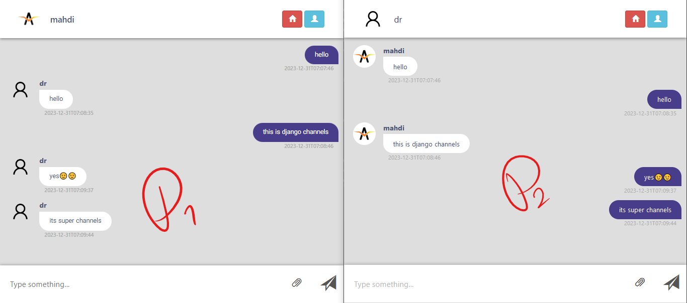

<div dir="rtl">

# جنگو سوپر چنلز | [EN](README.md)


 وب اپلیکیشن اتاق چت که بر اساس `django_super_channels` و با پروتکل های websockets پیاده سازی شده است.
 
[](#django-channels)
[](#django-channels)
[](#django-channels)
[](#django-channels)
[](#django-channels)
[](#django-channels)

**Django Super Channels** یک برنامه چت روم مبتنی بر جنگو چنلز است.
طراحی این اپلیکیشن، چت به صورت گروهی است.

# فرآیند کار
روند طراحی و عملکرد سوپر کانال ها به این صورت است که آدرس اتاق گفتگو در صفحه فهرست دریافت می شود. (در صورت موجود بودن چت روم وارد می شود و در صورت نبود چت روم ایجاد می شود).
پس از ورود فرد به اتاق می توانید با افرادی که وارد اتاق گفتگو شده اند ارتباط برقرار کنید.

<center></center>

طبق تصویر وقتی پیامی از طرف کاربر مهدی ارسال می شود، پیام از طریق وب سوکت به سرور ارسال می شود.
سرور یک بار پیام را در پایگاه داده ذخیره می کند و بدون نیاز به درخواست دوباره همان پیام را برای کاربر مهدی و سایر کاربران ارسال می کند.
تمامی پیام ها به صورت json از طریق کلاینت دریافت می شود و قسمت اصلی طراحی و نمایش پیام ها به عهده مشتری می باشد.

جنگو چنلز در قالب یک برنامه پیام‌رسان طراحی شده است که کلاینت آن جاوا اسکریپت است و بک‌اند آن یک اتصال مبتنی بر وب سوکت با جنگو ایجاد کرده است.
با این حال بیشتر عملیات نمایش بر سمت کلاینت میباشد و بک اند تنها طبق نیاز json های خود را ارسال میکند.

## کارایی 

> [!NOTE]
> هنگام نصب کتابخانه ها و اجرای پروژه بهتر است از **محیط مجازی** استفاده کنید.

> [!WARNING]
> قبل از اجرا، **redis** را روی سیستم نصب کنید. <br>
> [redis برای ویندوز](https://github.com/tporadowski/redis/releases) را دانلود و نصب کنید و در «cmd» عبارت «redis-server» را برای اجرای redis تایپ کنید.

**برای نصب کتابخانه های مورد نیاز:**
```
pip install -r requires.txt
```

**برای اجرای پروژه:**
```
python manager.py runserver
```

</div>