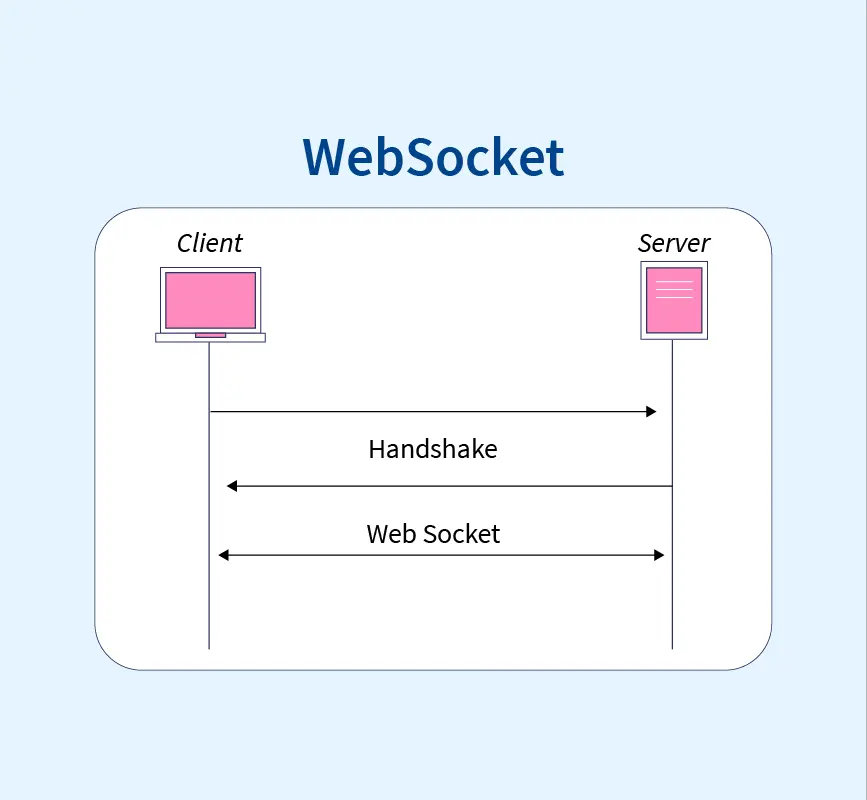

# Django Channels
Chat room web application based on `django_channels` and implemented with websockets protocol.

[](#django-channels)
[](#django-channels)
[](#django-channels)
[](#django-channels)
[](#django-channels)
[](#django-channels)

Channels support Django's native asynchronous view and allow Django projects to handle not only HTTP, but also protocols that require long-running connections - `WebSockets`, `MQTT`, `chatbots`, `amateur radio`, `etc`.
Now the django_channels architecture allows us to use websockets.
Protocols that provide the possibility of sending requests from both the server and the client side.

<center></center>

`django channels` is designed in the form of a messenger application whose client is javascript and its back-end has created a websocket-based connection with django.

<hr>

## Performance
> [!NOTE]
> It is better to use the `virtualenvironment` when installing libraries and running the project. 

> [!WARNING]
> Have redis installed on the system before running

**To install prerequisite libraries:**
```
pip install -r requirements.txt
```

**To Run The Project:**
```
python manage.py runserver
```