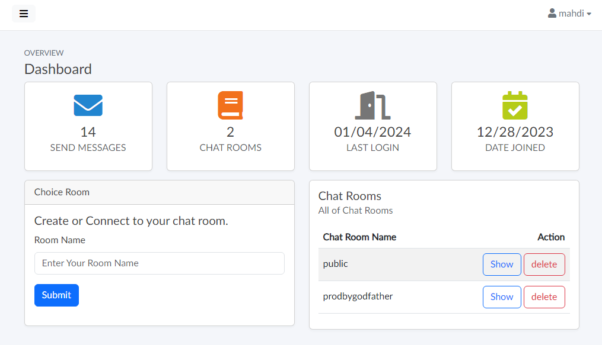

# Django Super Channels | [FA](README-FA.md)
Chat room web application based on `django_super_channels` and implemented with websockets protocol.

[](#django-channels)
[](#django-channels)
[](#django-channels)
[](#django-channels)
[](#django-channels)
[](#django-channels)
[](https://github.com//prodbygodfather)
[](https://github.com//prodbygodfather)

**Django Super Channels** is a chat room application based on django-channels.
The design of this application is group chat.
# Work process
The design and operation process of super channels is such that the address of the chat room is received on the index page. (if the chat room is available, it will be entered, and if it is not available, the chat room will be created).
After the person enters the room, you can communicate with the people who have entered the chat room.
<center></center>

According to the picture, when a message is sent from the `mahdi` user, the message is sent to the server through websocket.
The server saves the message once in the database and sends the same message again to the mahdi user and other users without the need for a request.
All messages are received in the form of json through the client, and the main part of designing and displaying the messages is the responsibility of the client.

`django channels` is designed in the form of a messenger application whose client is javascript and its back-end has created a websocket-based connection with django.

<center></center>

In addition to the Super Chat section, the dashboard section is intended for users, which makes the sections and settings of the user's account accessible. Basically, it shows the number of user messages, the number of chat rooms in which the user is present, along with the deletion and display section of the chat room, the last login to the account and the date of registration.
Other sections of this dashboard include the following sections:
1. Changing the password.
2. User account settings and user profile editing.
3. Logging out of the user account.

In fact, the main part is the user dashboard, which can be accessed only by logging into the user account.


## Performance

> [!NOTE]
> It is better to use the **virtualenvironment** when installing libraries and running the project. 


> [!WARNING]
> Have **redis** installed on the system before running. <br>
> download and install [redis for windows](https://github.com/tporadowski/redis/releases) and to `cmd` type `redis-server` to run the redis.

**To install required libraries:**
```
pip install -r requirements.txt
```

**To Run The Project:**
```
python manage.py runserver
```


